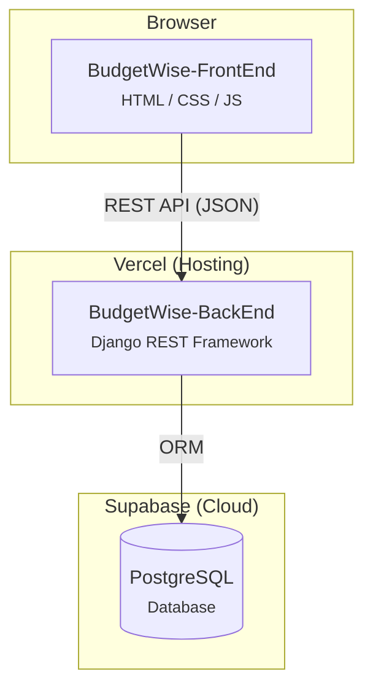
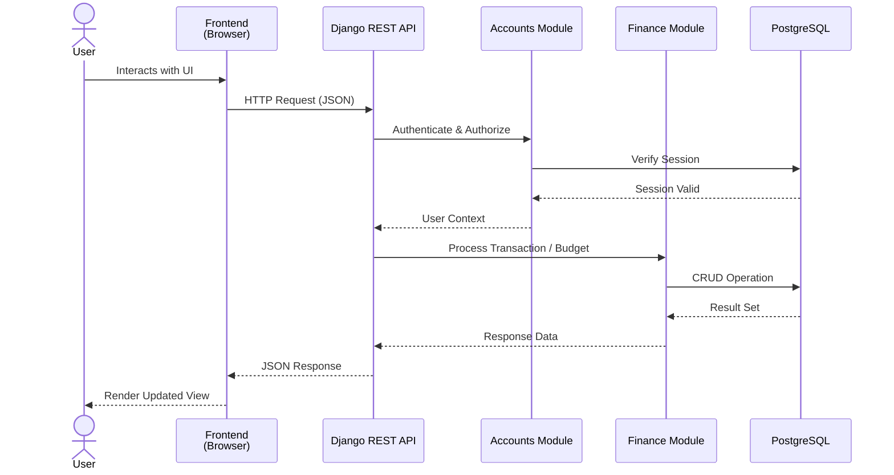
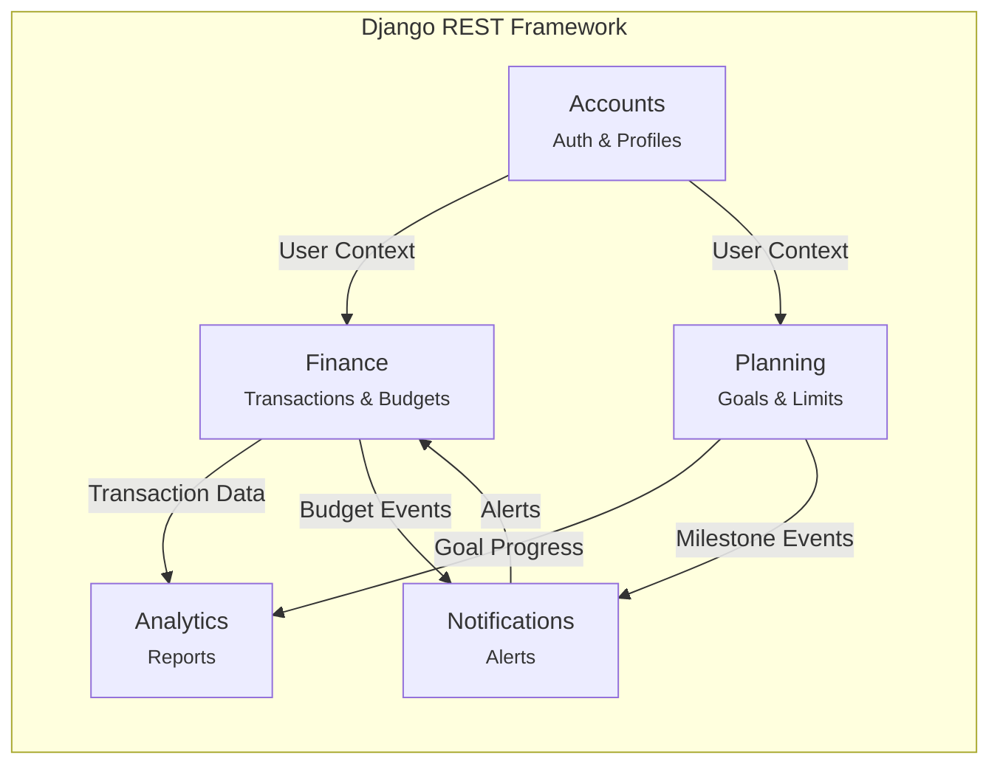

# BudgetWise

**BudgetWise** is a full-stack personal budgeting platform. Track income and expenses, set budget limits, visualize spending patterns, and save toward financial goals — all through a clean, responsive interface.

---

## Repositories

### [BudgetWise-BackEnd](https://github.com/BudgetWise-SWE/BudgetWise-BackEnd)

The API and business logic layer, built with **Django REST Framework** and deployed on Vercel.

| Technology | Purpose |
|---|---|
| Python / Django REST Framework | API server & business logic |
| PostgreSQL (Supabase) | Relational data store |
| Vercel | Hosting & deployment |
| MkDocs / OpenAPI (Swagger/ReDoc) | API documentation |

**Modules:**

| Module | Responsibility |
|---|---|
| `accounts` | Session-based authentication, custom user profiles, currency config |
| `finance` | Transaction CRUD, categorical classification, budget allocation |
| `planning` | Savings goals, spending limits |
| `analytics` | Dashboard summaries, spending distributions, trend reports |
| `notifications` | Event-driven alerts for budget thresholds and milestones |

**[→ Backend Repository](https://github.com/BudgetWise-SWE/BudgetWise-BackEnd)** · [Live API](https://budget-wise-back-end.vercel.app/api/docs/) · [Documentation](https://MuhammaddFouadd.github.io/BudgetWise-BackEnd/)

---

### [BudgetWise-FrontEnd](https://github.com/BudgetWise-SWE/BudgetWise-FrontEnd)

A modular client-side application built with **vanilla HTML, CSS, and JavaScript (ES modules)**.

| Technology | Purpose |
|---|---|
| HTML5 | Page structure |
| CSS3 (Flexbox / Grid) | Responsive layouts |
| JavaScript (ES modules) | Interactivity, state management, API integration |
| Material Symbols | Iconography |
| Chart.js | Spending visualizations |

**Pages:**

| Page | Description |
|---|---|
| `index` | Landing page |
| `login` / `signup` | Authentication with token-based session |
| `dashboard` | Overview — total balance, income, expenses, recent transactions |
| `transaction` | Add and view income/expense records with category selection |
| `budgets` | Monthly budget limits with visual status indicators |
| `savings` | Savings goal creation and progress tracking |
| `history` | Full transaction history with pagination |

**[→ Frontend Repository](https://github.com/BudgetWise-SWE/BudgetWise-FrontEnd)**

---

## Architecture

### System Overview



### Request Flow



### Backend Module Interactions



---

## Getting Started

**Backend**
```bash
git clone https://github.com/BudgetWise-SWE/BudgetWise-BackEnd.git
cd BudgetWise-BackEnd
python -m venv .venv && source .venv/bin/activate
pip install -r requirements.txt
python manage.py migrate
python manage.py runserver
```

**Frontend**
```bash
git clone https://github.com/BudgetWise-SWE/BudgetWise-FrontEnd.git
cd BudgetWise-FrontEnd
# Open index.html in your browser, or use Live Server
```

---

## License

All repositories are licensed under the [MIT License](https://opensource.org/licenses/MIT).
